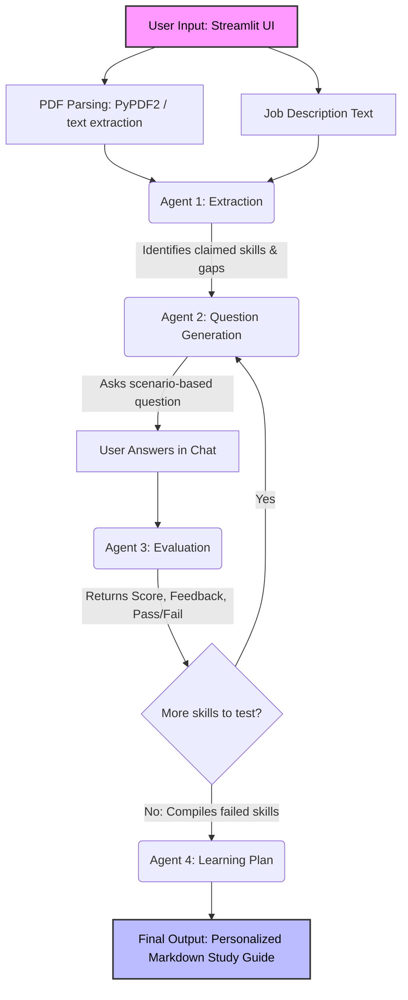

# Catalyst: AI Skill Assessment & Learning Plan Agent 🚀

**Catalyst** is an AI-powered technical recruiter and mentor. It solves a critical hiring problem: *a resume tells you what someone claims to know, not how well they actually know it.* This agent takes a Job Description and a candidate's resume, assesses real proficiency on each required skill through a conversational interview, identifies gaps, and generates a highly personalized, actionable learning plan.

Built for the Deccan AI Hackathon 2026 .

### 🔗 Important Links
* **Live Web App:** [Insert your Streamlit Share URL here]
* **Demo Video (3-5 mins):** [Insert your YouTube/Drive Video Link here]

---

## ✨ Key Features
1. **Intelligent Gap Analysis:** Cross-references resume claims with job requirements using strict JSON-schema extraction.
2. **Dynamic Scenario Interviews:** Generates practical, scenario-based questions rather than asking for rote definitions.
3. **Objective Evaluation:** Acts as a strict technical interviewer to grade responses (0-5 scale) and provide immediate feedback.
4. **Curated Learning Plans:** Compiles failed skills and initial gaps into a structured Markdown study guide with time estimates and free resources.

---

## 🧠 Architecture & Logic

Core Logic & State Management:
The application's "brain" relies on strict structural enforcement and persistent state tracking. To prevent the LLM from returning unpredictable conversational text, the backend utilizes Pydantic schemas paired with the LLM's JSON response formatting. This forces the agents to output highly reliable, validated JSON objects (e.g., specific lists of missing skills, or integer scores and boolean pass/fail flags) that the Python backend can programmatically parse.

To handle the conversational interview experience, the frontend leverages Streamlit's session_state. Because Streamlit reruns the entire script upon every user interaction, session_state is used as the application's short-term memory. It securely preserves the chat history, tracks the index of the current skill being tested, and aggregates the initial resume gaps alongside the skills failed during the interview, passing the complete list to the final agent to generate the learning plan.
